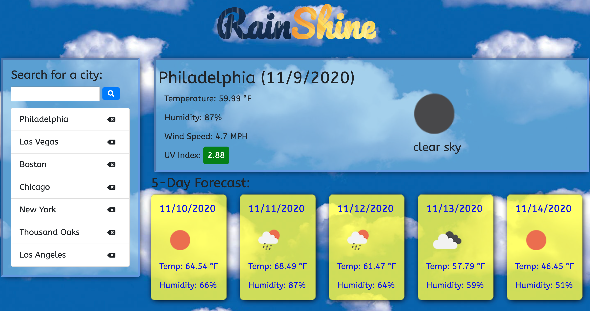

# rain-shine

This is a weather app that displays the current weather, as well as a 5 day forecast for the week ahead, of any city. I created this app using a third-party API from OpenWeather, calling upon their Current Weather Data API, as well as their OneCall API. I utilized Bootstrap for much of the formatting and styling, as well as creating my own styles in an external stylesheet. The app stores any cities you search for into your computer's local storage so that every time you revisit the website, you will see a history of those cities.

## Link

https://dj620.github.io/rain-shine/

## Usage

When you first get to the page, you can type in any city, and that cities weather data will be displayed. A button will be created with the cities name underneath the search box. If you enter a new city, that cities weather data will replace the first city, and another new button will be added to the list at the top. If you click a button that has already been created, that cities weather day will be displayed. I have also added a delete button that will remove a city from this list, in case you decide you do not want it as part of your search history.

## Credits

First I must credit the UCLA Extension Full-Stack Web Development Coding Bootcamp, instructor Bryan Swarthout, and TA Wilson Lam for providing me with all of the tools and knowledge I used to build this weather app.

http://www.uclaextension.edu

The weather data is provided by the OpenWeather API.

https://openweathermap.org/

I utilized Bootstrap to help format and style the page.

http://getbootstrap.com

I took the fonts 'ABeeZee' and 'Pacifico' from Google Fonts.

https://fonts.google.com

I created the favicon using favicon.io

https://favicon.io

## License

MIT License

Copyright (c) [2020] [DJ Hersh]

Permission is hereby granted, free of charge, to any person obtaining a copy
of this software and associated documentation files (the "Software"), to deal
in the Software without restriction, including without limitation the rights
to use, copy, modify, merge, publish, distribute, sublicense, and/or sell
copies of the Software, and to permit persons to whom the Software is
furnished to do so, subject to the following conditions:

The above copyright notice and this permission notice shall be included in all
copies or substantial portions of the Software.

THE SOFTWARE IS PROVIDED "AS IS", WITHOUT WARRANTY OF ANY KIND, EXPRESS OR
IMPLIED, INCLUDING BUT NOT LIMITED TO THE WARRANTIES OF MERCHANTABILITY,
FITNESS FOR A PARTICULAR PURPOSE AND NONINFRINGEMENT. IN NO EVENT SHALL THE
AUTHORS OR COPYRIGHT HOLDERS BE LIABLE FOR ANY CLAIM, DAMAGES OR OTHER
LIABILITY, WHETHER IN AN ACTION OF CONTRACT, TORT OR OTHERWISE, ARISING FROM,
OUT OF OR IN CONNECTION WITH THE SOFTWARE OR THE USE OR OTHER DEALINGS IN THE
SOFTWARE.
